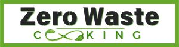
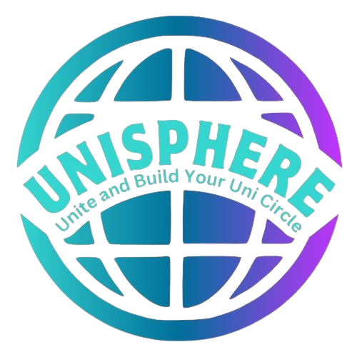

# Hi there, I'm Wai Yi Wong! 👋


[](https://www.linkedin.com/in/waiyi-wong)
[](mailto:wongwaverley@gmail.com)

> Welcome to my GitHub profile! I'm a passionate Data Analyst and Software Developer. Here's a bit about me:

## About Me
Passionate about using data and code to shape a better future, I bring a strong background in psychology and education, recently upskilled in programming for data analysis, visualisation, and software development. With over nine years of teaching experience, I excel in analytical thinking, project management, and presentation. My goal is to leverage my expertise in research and education, alongside modern data analytics and software development, to drive impactful insights and innovative solutions.

## 🛠️ Technical Stack
```javascript
const myTechStack = {
    'languages': ['Python', 'JavaScript', 'R', 'HTML', 'CSS'],
    'frameworks': ['Django', 'Bootstrap'],
    'software_dev': ['Git', 'Agile', 'API'],
    'cloud_platforms': ['Cloudinary', 'Heroku'],
    'databases': ['PostgreSQL'],
    'data_tools': ['Pandas', "NumPy", "Matplotlib", "Seaborn"],
    'machine_learning': ['Scikit-Learn', 'OpenAI']
};
```

## 🚀 Key Projects
### [Zero Waste Cooking (Django Web App)](https://github.com/waiyiwong/Zero_Waste_Cooking)
<p align="center">
    
</p>


A web application promoting sustainable cooking by helping users reduce food waste with a custom AI chatbot for recipe suggestions.

- **Tech Stack**: Django, PostgreSQL, HTML, CSS, JavaScript, Gemini AI 
- **GitHub**: [View Project](https://github.com/waiyiwong/Zero_Waste_Cooking)

### [UniSphere (Hackathon Project: College Connect Platform)](https://github.com/waiyiwong/Hackathon_UniSphere)
<p align="center">
    
</p>

A platform for students to collaborate, find resources, and network with peers.
- **Tech Stack**: Django, Bootstrap, JavaScript, PostgreSQL  
- **GitHub**: [View Project](https://github.com/waiyiwong/Hackathon_UniSphere)


### [Blockbuster Battle (Hackathon Project: Movie Grossing Quiz)](https://github.com/waiyiwong/Hackathon1_Blockbuster_Battle)
<p align="center">
    
</p>

An interactive quiz that challenges users to guess the higher-grossing movie.
- **Tech Stack**: JavaScript, HTML, CSS  
- **GitHub**: [View Project](https://github.com/waiyiwong/Hackathon1_Blockbuster_Battle)

### [Mindful Yoga Website](https://github.com/waiyiwong/mindful_yog)
<p align="center">
    
</p>

A platform integrating AI-powered affirmations and mindfulness resources for stress relief.
- **Tech Stack**: Bootstrap, JavaScript, AI integrations  
- **GitHub**: [View Project](https://github.com/waiyiwong/mindful_yoga)

## 🎯 Professional Goals

- Leveraging data analytics and software development to solve real-world problems  
- Enhancing user experience through AI-powered and data-driven solutions  
- Continuous learning in Python, machine learning, and data visualisation

## 🌱 Currently Learning
- React
- Machine Learning

## 📬 Connect With Me

- **LinkedIn**: [](https://www.linkedin.com/in/waiyi-wong)
- **GitHub**: [](https://github.com/waiyiwong)
- **Portfolio**: [](https://github.com/waiyiwong)

---
*Build Tomorrow with Code and Analytics* 🚀

